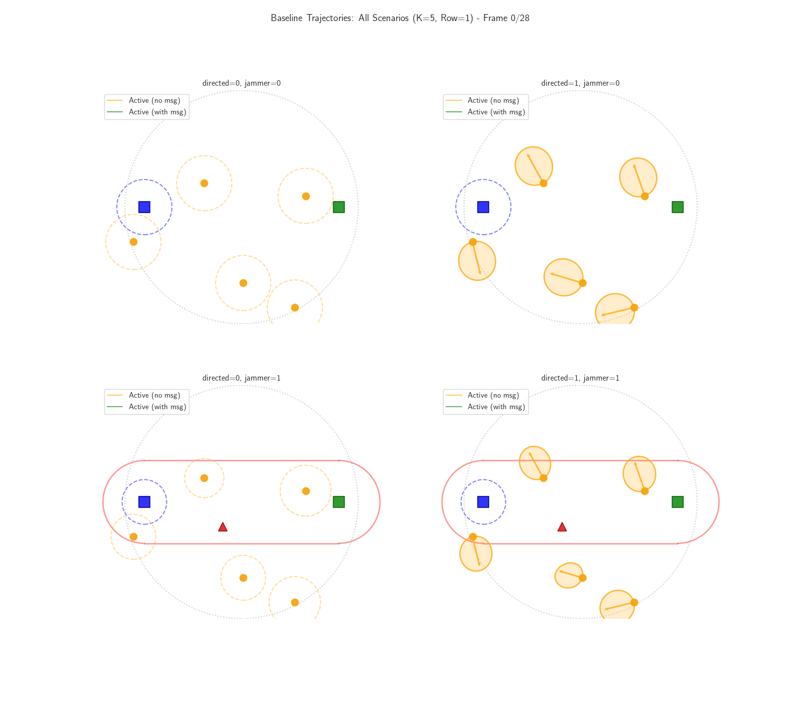

# Information Relaying Environment 

Simulator for testing out the information relaying environemnt and training the agents using MARL. 

## Running the simulator with BenchMARL (for training)
Training of the info relay environment in the easiest way possible is currently using [BenchMARL](https://github.com/facebookresearch/BenchMARL).

In order to run the simulator together with BenchMARL, the following steps have to be made:
1. Clone the Information Relaying repository and the BenchMARL submodule with:
    - git clone --recurse-submodule url/to/info_relay_env
    - it is also possible to clone without the --recurse-submodule flag and insteadrun the following commands after installation (cd Information-Relaying):
        * git submodule init
        * git submodule update

2. Now it is necessary to setup a virtual environment. Use python 3.11:
    - python3.11 -m venv path/to/venv
    Now install BenchMARL in the venv (The venv can be activated by running source path/to/env/bin/activate). The BenchMARL folder is located under Info-relay-implementation.
    - pip install -e BenchMARL/
    Then install all other requirements (which will overwrite some version given by BenchMARL - this is fine)
    pip install -r Info-relay-implementation/benchmarl_integration/requirements.txt

3. Now the info relay env and BenchMARL should be working and training can be run using 
    - python BenchMARL/benchmarl/run.py algorithm=mappo task=customenv/info_relay
    Changing the training parameters is done inside the benchmarl_conf folder. Experiment parameters (like lr and number of training episodes) are changed in the base_experiment.yaml file, while parameters in the info relay env (like the number of agents or if a jammer is to be used) are changed in info_relay.yaml. The files inside the BenchMARL folder that are a part of the info relay env are symbolic links of the files in this repository, as such, changes made in the files here are automatically applied inside BenchMARL.  

