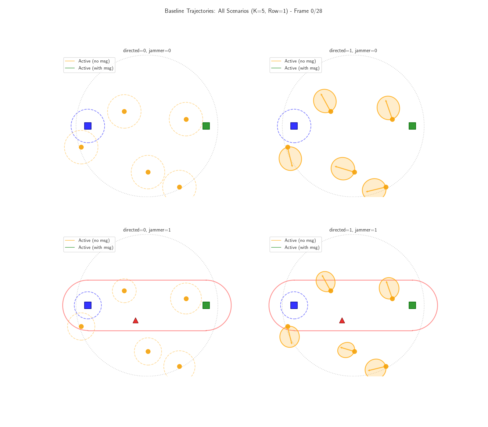

# Information Relaying Environment 

Information relaying game: collaborative game in which agents control their motion and antennas to relay one message from a transmitting base station (blue square) to a receiving base (green square), preferably as fast as possible with minimal movement. 
Four scenarios are considered given by the combinations of isotropic or directed data links with the presence or absence of a jammer.

The repository contains the information relaying environment simulator, a multi-agent reinforcement learning (MARL) framework ([BenchMARL](https://github.com/facebookresearch/BenchMARL)) for training agents to solve the information relaying problem, and hand-crafted baseline. 



## Running the simulator in demo mode
1. Run Info_relay.py with or without the --keyboard flag to run the environment without an agent

## Running the simulator with BenchMARL (for training)
Training of the info relay environment in the easiest way possible is currently using [BenchMARL](https://github.com/facebookresearch/BenchMARL).

In order to run the simulator together with BenchMARL, the following steps have to be made:
1. Clone the Information Relaying repository and the BenchMARL submodule with:
    - git clone --recurse-submodule url/to/info_relay_env
    - it is also possible to clone without the --recurse-submodule flag and insteadrun the following commands after installation (cd Information-Relaying):
        * git submodule init
        * git submodule update

2. Now it is necessary to setup a virtual environment. Use python 3.11:
    - python3.11 -m venv path/to/venv
    Now install BenchMARL in the venv (The venv can be activated by running source path/to/env/bin/activate). The BenchMARL folder is located under Info-relay-implementation.
    - pip install -e BenchMARL/
    Then install all other requirements (which will overwrite some version given by BenchMARL - this is fine)
    pip install -r Info-relay-implementation/benchmarl_integration/requirements.txt

3. Now the info relay env and BenchMARL should be working and training can be run using 
    - python BenchMARL/benchmarl/run.py algorithm=mappo task=customenv/info_relay
    Changing the training parameters is done inside the benchmarl_conf folder. Experiment parameters (like lr and number of training episodes) are changed in the base_experiment.yaml file, while parameters in the info relay env (like the number of agents or if a jammer is to be used) are changed in info_relay.yaml. The files inside the BenchMARL folder that are a part of the info relay env are symbolic links of the files in this repository, as such, changes made in the files here are automatically applied inside BenchMARL.

## Running the environment with pre-trained agent
1. Make sure the repo is cloned with git lfs installed "git lfs install".
    You will then receive the outputs/ folder containing checkpoints.
    Run Info-relay-implementation/BenchMARL/benchmarl/evaluate.py with
    a checkpioint file as argument. To run on evaluation set, change the default
    parameter boolean pre_determined_scenario in info_relay-env_v2.py to True.

## Running the baseline
The baseline takes a scene (an initial state defining agent positions and antenna orientations, and distance between bases, and one of the four scenarios) and returns a solution to the relaying problem as a full state trajectory of all agents. 
This can be done in the following steps:

1. **Set up environment parameters:**
   ```python
   from Baseline.baseline import baseline, sample_scenario, load_premade_scenario
   
   Rcom = 1.0        # Communication range
   sigma = 0.2       # Maximum agent displacement per time step
   beta = 0.99       # Discount factor
   c_pos = 0.5       # Cost coefficient for agent movement
   c_phi = 0.1       # Cost coefficient for antenna steering
   ```

2. **Load or generate a scene:**
   ```python
   # Option A: Load a premade scene 
   sample = load_premade_scenario(option=1, Rcom=Rcom, sigma=sigma)
   
   # Option B: Sample a random scenario
   # sample = sample_scenario(K=5, Rcom=Rcom, R=5.0, Ra=0.6, sigma=sigma, seed=42)
   ```

3. **Configure scenario parameters:**
   ```python
   directed = False          # True for directional antenna transmission
   phi_agents = sample['phi_agents'] if directed else None
   
   jammer_info = None        # Set jammer parameters for jammed scenarios
   # For jammed scenario, use: jammer_info = {'p_jammer': sample['p_j'], 'v_jammer': sample['dp_j']}
   ```

4. **Run the baseline solver:**
   ```python
   result = baseline(
       p_agents=sample['p_agents'],
       p_tx=sample['p_tx'],
       p_recv=sample['p_recv'],
       Rcom=Rcom,
       sigma=sigma,
       beta=beta,
       c_pos=c_pos,
       c_phi=c_phi,
       phi_agents=phi_agents,
       jammer_info=jammer_info
   )
   ```

5. **Extract the solution:**
   ```python
   # Key outputs from result dictionary:
   path = result['path']                    # Relay path (agent sequence)
   relay_points = result['relay_points']    # Positions where agents relay
   p_trajectories = result['p_trajectories'] # Agent position trajectories over time
   value = result['value']                  # Solution quality metric (budget - cost)
   delivery_time = result['delivery_time']  # Time steps to deliver message
   ```

6. **Visualize the solution:**
    ```python
    from Evaluation.evaluate import plot_trajectory, animate_trajectory
    
    # Option A: Static plot of agent trajectories
    plot_trajectory(
       result['p_trajectories'],
       sample['p_tx'],
       sample['p_recv'],
       sample['Rcom'],
       savepath=None  # Set to a path string to save as image
    )
    
    # Option B: Animation of agent trajectories over time
    animate_trajectory(
       result['p_trajectories'],
       sample['p_tx'],
       sample['p_recv'],
       sample['Rcom'],
       savepath='baseline_animation.gif'  # Set to None to display without saving
    )
    ```

## Cite
@article{persson2025dynamic,
  title={Dynamic one-time delivery of critical data by small and sparse UAV swarms: a model problem for MARL scaling studies},
  author={Persson, Mika and Lidman, Jonas and Ljungberg, Jacob and Sandelius, Samuel and Andersson, Adam},
  journal={arXiv preprint arXiv:2512.09682},
  year={2025}
}

